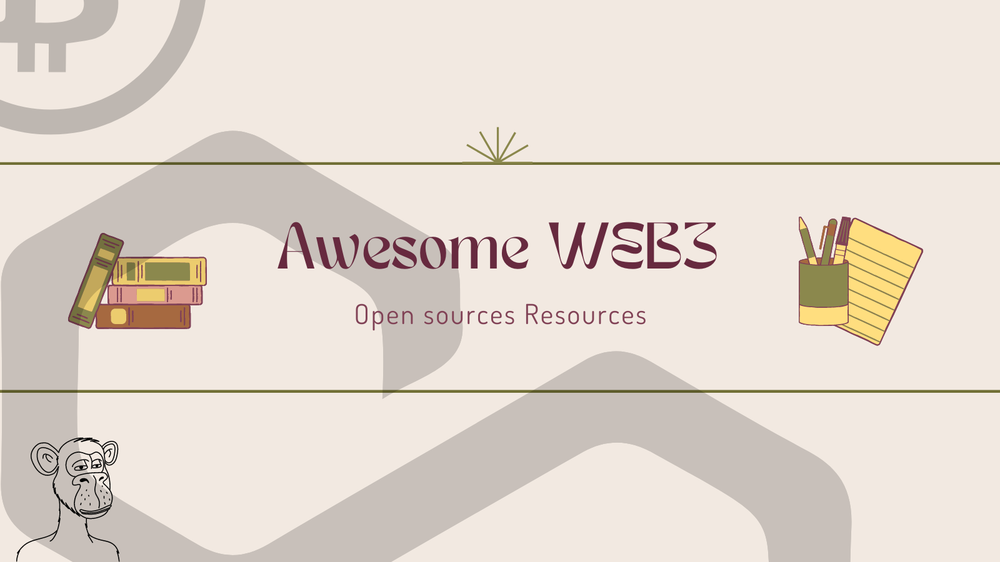

# 🎩Awesome WEB3✨

🧙‍♂️ Welcome to Awesome WEB3, where we weave spells of knowledge to demystify the world of blockchain! 🪄 Our magical GitHub project aims to educate aspiring sorcerers (developers) about Web3 and empower them to harness the power of decentralized sorcery. From creating potions (smart contracts) to conjuring enchanted applications (DApps), we've got you covered! 🌟 this repo, explore spellbinding tutorials, unravel the secrets of decentralized finance (DeFi), and dive into the mystical depths of WEB3. Gather your wands (laptops) and embark on this whimsical journey to become a true Web3 wizard! 🎩✨

## Index

- [🎩Awesome WEB3✨](#awesome-web3)
	- [Index](#index)
	- [Introduction](#introduction)
		- [History of WEB3](#history-of-web3)
	- [Getting Started](#getting-started)
	- [Tutorials](#tutorials)
	- [Sample Projects](#sample-projects)
	- [Resource Links](#resource-links)
	- [Contribution Guidelines](#contribution-guidelines)
	- [Community Discussion](#community-discussion)
	- [Versioning and Releases](#versioning-and-releases)
	- [Promotion and Sharing](#promotion-and-sharing)

## Introduction

Once upon a time, in the mystical realm of the internet, there was a magical land called Web3. 🌐✨ Unlike its predecessors, Web3 was no ordinary land—it was a place where blockchain sorcery reigned supreme! 🧙‍♂️💫

In Web3, the power to create, transact, and collaborate was no longer in the hands of a single central authority. It was like a massive game of Quidditch, where everyone could play, make the rules, and score goals! ⚡🪄

Imagine a world where you could own digital assets as unique as a golden unicorn or a pixelated potion, and trade them with fellow adventurers, all without needing a goblin banker. That's Web3! It's a decentralized playground where you can be a hero, an artist, or a digital treasure hunter—all in the blink of an eye! 😄💰

But beware, young padawan, for Web3 isn't all rainbows and unicorns. It has its challenges too! The land is guarded by clever smart contracts, digital spells written in code that ensure trust and fairness. It's like having magical creatures working tirelessly to make sure no mischief-makers get their hands on your hard-earned treasures. 🦄🔒

So, gather your sense of adventure, your quill (keyboard), and embark on a journey into the enchanting world of Web3. Learn the ways of the blockchain, create your own spells using smart contracts, and unlock the secrets of decentralized finance. Get ready to laugh, learn, and have a wizarding good time! 🎩✨🚀

### History of WEB3 
Once upon a time, in the land of the internet, there was Web1, a simple and static place where websites were as exciting as watching paint dry. It was like a kingdom ruled by a single king, and the people had no say in the matters of their digital lives. 🏰😴

Then, one day, a mischievous sorcerer named [Satoshi Nakamoto](https://en.wikipedia.org/wiki/Satoshi_Nakamoto) appeared out of thin air. With a flick of their wand, they introduced Bitcoin, the first-ever cryptocurrency, and the crowd went wild! It was like discovering a treasure chest full of virtual gold coins. 💰✨

But the story didn't end there. A clever band of developers saw the potential of this blockchain magic and wanted to take it further. They whispered among themselves, "Let's create a Web3, a land where people can do more than just trade coins!" 🌐🔮

And so, Web3 was born—a place where people could build decentralized applications (DApps) and create their own digital worlds. It was like a massive Lego set, where everyone could be a master builder, constructing their own imaginative realms. 🏗️🎮

Web3 brought with it smart contracts, powerful spells written in code that automated agreements and eliminated the need for pesky middlemen. It was like having digital fairies watching over your transactions, making sure everything was as smooth as butter. ✨🧚

Now, people could not only trade digital assets but also lend, borrow, and participate in wild decentralized finance (DeFi) experiments. It was like a wild circus with acrobatic tokens and money markets, where even a clownfish could get a loan! 🤡🎪

But amidst all the fun and excitement, Web3 faced its own share of dragons to slay. Scalability, usability, and interoperability became the challenges of this brave new land. It was like fighting fire-breathing dragons while riding a unicycle—challenging, yet exhilarating! 🐉🤹‍♂️

So, dear adventurer, fasten your digital seatbelt and get ready for a rollercoaster ride through the history of Web3. From the humble beginnings of Bitcoin to the rise of Ethereum and beyond, it's a tale of innovation, empowerment, and the quest for a more inclusive and magical internet! 🚀✨

## Getting Started

Learn how to embark on your journey as a Web3 wizard. Discover the tools, setup, and prerequisites required to start your adventure in the realm of blockchain.

## Tutorials

Explore our collection of enchanting tutorials that delve into the core concepts of Web3. From blockchain basics to smart contract development, these tutorials will guide you through the mystical intricacies of decentralized magic.

## Sample Projects

Dive into our captivating sample projects and witness practical implementations of Web3 sorcery. These projects showcase the art of creating decentralized applications, interacting with blockchain networks, and integrating with various protocols.

## Resource Links

Unleash your thirst for knowledge by exploring our curated list of external resources. Find official documentation, online courses, insightful articles, and vibrant communities that will propel your understanding of Web3 to new heights.

## Contribution Guidelines

Ready to join our fellowship of Web3 wizards? Learn how to contribute to our magical GitHub project by adding resources, fixing bugs, enhancing documentation, or casting your own spells of improvement.

## Community Discussion

Engage with fellow sorcerers in our mystical discussion forum. Ask questions, share insights, and seek assistance as you navigate the enchanting world of Web3. Together, let's forge a vibrant and supportive community.

## Versioning and Releases

Stay up to date with the latest releases and changes to our Web3 Wizards project. Explore different versions, milestones, and improvements as we continue to unravel new spells and unlock exciting features.

## Promotion and Sharing

Help us spread the magic of Web3! Share our GitHub project on social media, developer forums, and with aspiring sorcerers who seek the path of decentralized knowledge. Let's grow our enchanting community together!
