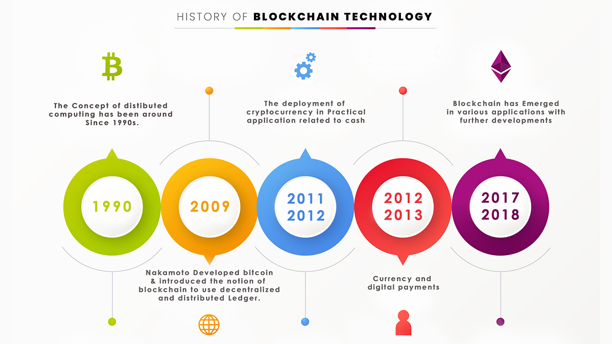
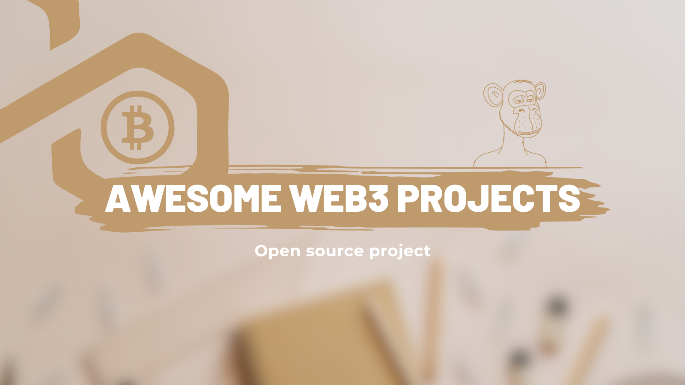

# 🎩Awesome WEB3✨

🧙‍♂️ Welcome to Awesome WEB3, where we weave spells of knowledge to demystify the world of blockchain! 🪄 Our magical GitHub project aims to educate aspiring sorcerers (developers) about Web3 and empower them to harness the power of decentralized sorcery. From creating potions (smart contracts) to conjuring enchanted applications (DApps), we've got you covered! 🌟 this repo, explore spellbinding tutorials, unravel the secrets of decentralized finance (DeFi), and dive into the mystical depths of WEB3. Gather your wands (laptops) and embark on this whimsical journey to become a true Web3 wizard! 🎩✨

## Index

- [🎩Awesome WEB3✨](#awesome-web3)
	- [Index](#index)
	- [Introduction](#introduction)
		- [History of WEB3](#history-of-web3)
		- [WEB3](#web3)
		- [Blockchain vs WEB3](#blockchain-vs-web3)
	- [Getting Started](#getting-started)
	- [Tutorials](#tutorials)
	- [Awesome WEB3 projects](#awesome-web3-projects)
	- [Resource Links](#resource-links)
	- [Contribution Guidelines](#contribution-guidelines)
	- [Community Discussion](#community-discussion)
	- [Versioning and Releases](#versioning-and-releases)
	- [Promotion and Sharing](#promotion-and-sharing)

## Introduction

### History of WEB3 
Once upon a time, in the land of the internet, there was Web1, a simple and static place where websites were as exciting as watching paint dry. It was like a kingdom ruled by a single king, and the people had no say in the matters of their digital lives. 🏰😴

Then, one day, a mischievous sorcerer named [Satoshi Nakamoto](https://en.wikipedia.org/wiki/Satoshi_Nakamoto) appeared out of thin air. With a flick of their wand, they introduced Bitcoin, the first-ever cryptocurrency, and the crowd went wild! It was like discovering a treasure chest full of virtual gold coins. 💰✨

But little did the crowd know that Bitcoin was more than just a shiny treasure chest of virtual gold coins. It was built on a revolutionary technology called blockchain, a magical ledger that recorded every transaction and kept it safe from the prying eyes of wicked trolls and fraudsters. It was like an unbreakable lock that guarded the kingdom's wealth. 🔒🔐

As the news of Bitcoin spread across the realms of the internet, a wave of curiosity and excitement swept through the people. They started to wonder, "If we can create a digital currency, what else can we create with this blockchain sorcery?"

Enter the wizards and witches of the coding world. They began brewing new potions, known as altcoins, each with its own unique twist on the blockchain magic. Some potions focused on faster transactions, while others promised enhanced privacy or even the ability to execute smart contracts. It was like a magical bazaar with countless potions to choose from, each vying for attention and claiming to be the next big thing in the realm of digital currencies. 🧪🌌

Among these potions, Ethereum emerged as a game-changer. It brought forth the concept of smart contracts, a way to encode agreements and automate transactions using code. It was like having a team of tireless wizards who executed your instructions faithfully, without the need for intermediaries or trust in fallible humans. 🤝✨

With smart contracts, the possibilities of Web3 expanded even further. People could now create decentralized applications (DApps) that ran on the Ethereum platform. These DApps ranged from virtual worlds where players could battle mythical creatures to decentralized exchanges where people could trade their digital treasures. It was like a grand fairground filled with attractions, where every booth held a new adventure. 🎠🎮

As time went on, the Web3 ecosystem continued to grow and evolve. New protocols and projects emerged, each adding its own unique flavor to the blockchain landscape. From decentralized finance (DeFi) platforms that offered loans and earning opportunities to non-fungible tokens (NFTs) that turned digital art into collectible treasures, the realm of Web3 became a playground for innovation and experimentation. It was like watching a magical garden bloom with vibrant flowers of endless possibilities. 🌷🌼

And so, the story of Web3 continues to unfold. As more people join the quest for decentralized power and freedom, the realm expands and transforms. The mischievous sorcerer, Satoshi Nakamoto, may have started it all with a flick of their wand, but it is the collective magic and creativity of countless wizards and witches that shape the future of Web3—a future where the internet becomes a truly inclusive, transparent, and empowering force for all. ✨🌐

Web3 brought with it smart contracts, powerful spells written in code that automated agreements and eliminated the need for pesky middlemen. It was like having digital fairies watching over your transactions, making sure everything was as smooth as butter. ✨🧚

Now, people could not only trade digital assets but also lend, borrow, and participate in wild decentralized finance (DeFi) experiments. It was like a wild circus with acrobatic tokens and money markets, where even a clownfish could get a loan! 🤡🎪

But amidst all the fun and excitement, Web3 faced its own share of dragons to slay. Scalability, usability, and interoperability became the challenges of this brave new land. It was like fighting fire-breathing dragons while riding a unicycle—challenging, yet exhilarating! 🐉🤹‍♂️

So, dear adventurer, fasten your digital seatbelt and get ready for a rollercoaster ride through the history of Web3. From the humble beginnings of Bitcoin to the rise of Ethereum and beyond, it's a tale of innovation, empowerment, and the quest for a more inclusive and magical internet! 🚀✨

### WEB3

In Web3, the power to create, transact, and collaborate was no longer in the hands of a single central authority. It was like a massive game of Quidditch, where everyone could play, make the rules, and score goals! ⚡🪄

Imagine a world where you could own digital assets as unique as a golden unicorn or a pixelated potion, and trade them with fellow adventurers, all without needing a goblin banker. That's Web3! It's a decentralized playground where you can be a hero, an artist, or a digital treasure hunter—all in the blink of an eye! 😄💰

But beware, young padawan, for Web3 isn't all rainbows and unicorns. It has its challenges too! The land is guarded by clever smart contracts, digital spells written in code that ensure trust and fairness. It's like having magical creatures working tirelessly to make sure no mischief-makers get their hands on your hard-earned treasures. 🦄🔒

So, gather your sense of adventure, your quill (keyboard), and embark on a journey into the enchanting world of Web3. Learn the ways of the blockchain, create your own spells using smart contracts, and unlock the secrets of decentralized finance. Get ready to laugh, learn, and have a wizarding good time! 🎩✨🚀

### Blockchain vs WEB3 
Till this point in the story, you may get a little confused and wonder, "Are Web3 and blockchain the same thing?" Well, fear not, for I shall unravel the difference between these two enchanting concepts! 🧙‍♂️🔍

Web3 and blockchain are not the same, my curious friend. While they are closely intertwined, they each have their unique roles in the digital realm. Think of Web3 as the vast kingdom where exciting adventures unfold, and blockchain as the magical tool that makes those adventures possible. They work hand in hand, but they are not one and the same. 🌐🔗

Web3 is the grand vision, the concept of a user-centric and decentralized internet. It encompasses the idea of giving power back to the people, enabling them to control their data, participate in governance, and interact directly with one another. It's like a dreamland where the internet becomes more inclusive, transparent, and fair for all. 🌈✨

On the other hand, blockchain is the technical marvel that supports the Web3 vision. It's a revolutionary technology that acts as a decentralized ledger, a digital record-keeping system that ensures transparency and security. It's like an unbreakable chain that links all the transactions and activities in a way that cannot be tampered with. ⛓️🔒

While blockchain plays a vital role in enabling Web3, it is just one piece of the puzzle. Web3 encompasses a broader scope, involving not only blockchain but also other innovative technologies and principles. It embraces the ideals of decentralization, self-sovereignty, and user empowerment. It's like a vast landscape where blockchain is a significant landmark but not the entire territory. 🗺️🌌

So, my dear adventurer, remember this: Web3 is the vision, the magical world we aspire to create, where individuals have greater control and freedom in the digital realm. Blockchain, on the other hand, is the powerful enchantment, the technology that supports and upholds that vision, providing security, transparency, and trust. Together, they form the foundation of a new era of possibilities, transforming the way we experience the internet and embark on our digital quests! ✨🌐🔮

## Getting Started

Learn how to embark on your journey as a Web3 wizard. Discover the tools, setup, and prerequisites required to start your adventure in the realm of blockchain.

## Tutorials

Explore our collection of enchanting tutorials that delve into the core concepts of Web3. From blockchain basics to smart contract development, these tutorials will guide you through the mystical intricacies of decentralized magic.

## Awesome WEB3 projects

In the realm of Web3, learning by building projects is like embarking on a quest filled with magical discoveries and personal growth. It's a journey where you don't just read about the enchanting world of blockchain and decentralized applications (DApps), but actively wield the tools of creation and witness your ideas come to life. 🌟🔨

When you dive into the realm of Web3 projects, you become a sorcerer's apprentice, honing your skills and expanding your knowledge with each spell you cast. It's an immersive and hands-on experience that takes you beyond theoretical understanding and immerses you in the practical realm of blockchain sorcery. ✨🔮

As you undertake the creation of Web3 projects, you'll face thrilling challenges and encounter the unexpected. It's like navigating through a labyrinth, solving puzzles and overcoming obstacles along the way. But fear not, for with each hurdle you conquer, you gain new insights and level up your abilities. It's a journey of personal growth and continuous learning. 🚀📚

By building Web3 projects, you unlock the secrets of decentralized applications, smart contracts, and interacting with blockchain networks. You grasp the concepts of decentralized finance (DeFi), tokenization, and the power of blockchain for transparent and secure transactions. It's like obtaining a magical map that guides you through the vast landscape of Web3 possibilities. 🗺️💡

But the true magic of learning by building projects lies in the hands-on experience and the lessons learned from tinkering with the enchanted tools. It's through the process of trial and error, debugging spells, and unleashing your creativity that you truly grasp the nuances of Web3. You gain a deep understanding of how the pieces fit together, the intricacies of smart contracts, and the challenges and potentials of decentralized systems. It's an education like no other, where you are both the student and the sorcerer. 🎓🧙‍♀️

So, young sorcerer, embrace the path of learning by building projects in the realm of Web3. Let your imagination soar, choose your quests wisely, and immerse yourself in the wondrous world of decentralized magic. With each project you embark upon, you'll grow in knowledge and skill, becoming a true master of Web3 and shaping the future of this enchanting realm! 🌐✨🔥

## Resource Links

Unleash your thirst for knowledge by exploring our curated list of external resources. Find official documentation, online courses, insightful articles, and vibrant communities that will propel your understanding of Web3 to new heights.

## Contribution Guidelines

Ready to join our fellowship of Web3 wizards? Learn how to contribute to our magical GitHub project by adding resources, fixing bugs, enhancing documentation, or casting your own spells of improvement.

## Community Discussion

Engage with fellow sorcerers in our mystical discussion forum. Ask questions, share insights, and seek assistance as you navigate the enchanting world of Web3. Together, let's forge a vibrant and supportive community.

## Versioning and Releases

Stay up to date with the latest releases and changes to our Web3 Wizards project. Explore different versions, milestones, and improvements as we continue to unravel new spells and unlock exciting features.

## Promotion and Sharing

Help us spread the magic of Web3! Share our GitHub project on social media, developer forums, and with aspiring sorcerers who seek the path of decentralized knowledge. Let's grow our enchanting community together!
